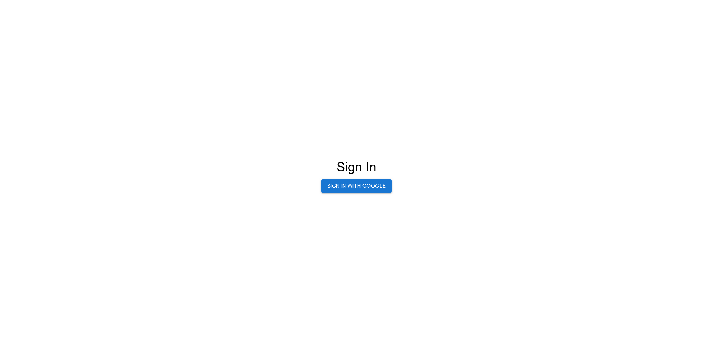
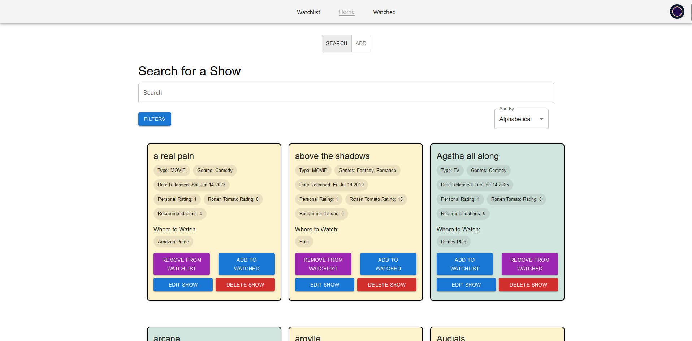
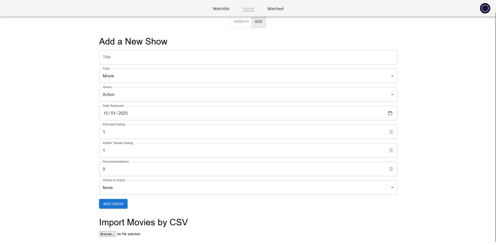
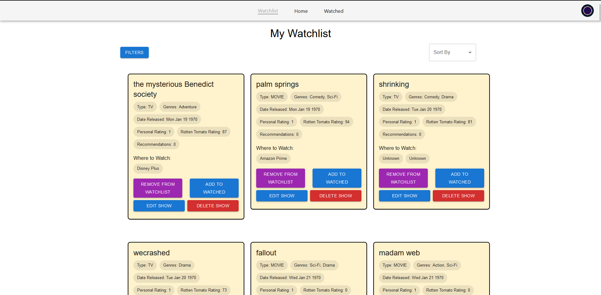
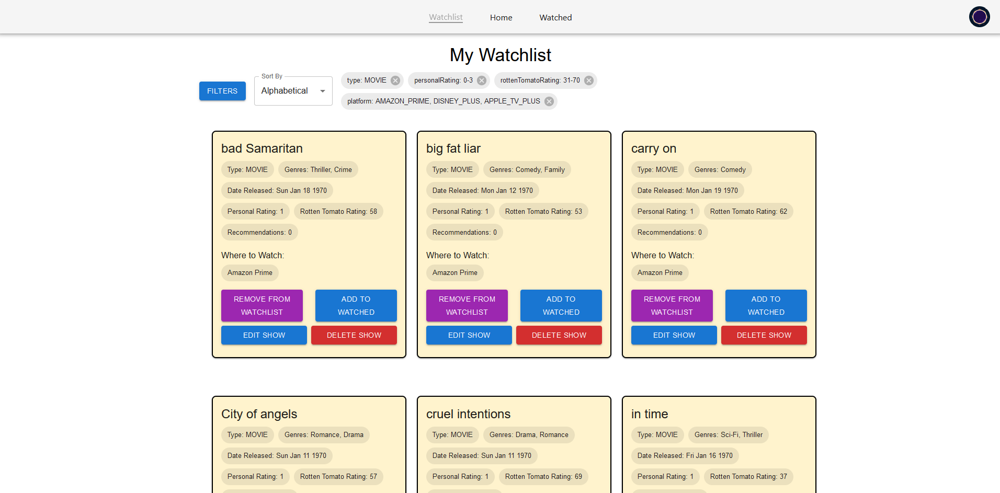

# TV shows / Movies viewer

I was approached by Jerry (anonymised name), and he has commissioned me to create a tv show / movie viewer. He wants to be able to organise the movies on his watch list, and rate them.

After an extensive interview, I was able to extract this list of requirements.

## Requirements

-   A collection of movies and tv shows
-   A gui that enables a user to:
    -   Add a new entry
    -   Edit an entry
    -   Delete an entry
    -   Filter by:
        -   Tv shows / Movies
        -   Personal rating (In a range)
        -   Rotten tomato rating (In a range)
        -   Platform to watch on (Netflix, Amazon Prime etc.)
        -   Watched / Not Watched / Rated / Not Rated
    -   Sort by:
        -   Personal rating (low <-> high)
        -   Rotten tomato rating (low <-> high)
        -   Alphabetical
        -   Date released (Recent <-> Old)
        -   Date added to list (Recent <-> Old)
        -   Number of recommendations
-   A user account
    -   Can sign in across devices
    -   Secure
        -   Password is not stored - hash
    -   A profile page with some information about the user

## Classes Needed

From these requirements, I concluded that theses would be the necessary classes.

-   Show [CLASS]
    -   ID: _UUID_
    -   Type: _ShowType_
    -   Title: _STRING_
    -   Genres: _ARRAY of ShowGenre_
    -   Date released: _DATE_
    -   Date added: _DATE_
    -   Personal rating: _NUMBER (0 - 10)_
    -   Rotten tomato rating: _NUMBER (0 - 100)_
    -   Recommendations: _INTEGER_
    -   Where to watch: _ARRAY of StreamingPlatform_
-   Movie [SUBCLASS of Show]:
    -   Length: _NUMBER INT (Seconds)_
-   Tv [SUBCLASS of Show]:
    -   Seasons: _NUMBER INT_
    -   Episodes: _NUMBER INT_
-   User [CLASS]
    -   ID: _UUIDS_
    -   Name: _STRING_
    -   Password hash: _STRING_
    -   Watched: _ARRAY of Shows_
    -   Watchlist: _ARRAY of Shows_
    -   Date joined: _DATE_
-   StreamingPlatform [CLASS]
    -   Name: _STRING_
    -   Is Free: _BOOLEAN_
    -   Colour: _STRING_ (Hex/RGB)
-   ShowType [ENUM]:
    -   "TV"
    -   "MOVIE"
-   ShowGenre [ENUM]:
    -   "ROMANCE"
    -   "ACTION"
    -   "SCI-FI"
    -   "DRAMA"
    -   "COMEDY"
    -   more...

## UI Plan

[Figma Link](https://www.figma.com/design/AltDQREfwKEPBVW3GRyhiB/Watchlist_website?node-id=0-1&t=JkS7BfM77wp5y5Ki-1)

## Architecture / Frameworks

I plan to use React as my front end framework, in Typescript.  
I also plan to use FastApi as my backend.

## Acceptance Testing

-   A collection of movies and tv shows  
    This has been met.

-   A gui that enables a user to:

    -   Add a new entry  
        _This has been met._
    -   Edit an entry  
        _This has been met._
    -   Delete an entry  
        _This has been met._
    -   Filter by:
        -   Tv shows / Movies  
            _This has been met._
        -   Personal rating (In a range)  
            _This has been met **to an extent**. Ranges could be adapted to allow any range, whereas currently the ranges are predefined._
        -   Rotten tomato rating (In a range)  
            _This has been met **to an extent**. Ranges could be adapted to allow any range, whereas currently the ranges are predefined._
        -   Platform to watch on (Netflix, Amazon Prime etc.)  
            _This has been met._
        -   Watched / Not Watched / Rated / Not Rated  
            _This has been **partially**. You can filter by "on watchlist", "watched" and neither. There is no filter for rated or not rated._
    -   Sort by:
        -   Personal rating (low <-> high)  
            _This has been **partially** met. You cannot change the direction of the sort, it is only low to high._
        -   Rotten tomato rating (low <-> high)  
            _This has been **partially** met. You cannot change the direction of the sort, it is only low to high._
        -   Alphabetical  
            _This has been **partially** met. You cannot change the direction of the sort, it is only a to z and not reverse._
        -   Date released (Recent <-> Old)
            _This has been **partially** met. You cannot change the direction of the sort, it is only Recent to Old._
        -   Date added to list (Recent <-> Old)
            _This has **not** been met. You cannot sort by when the show was added to the watched list and/or watchlist and/or database._
        -   Number of recommendations  
            _This has been **partially** met. You cannot change the direction of the sort, it is only low to high._

-   A user account
    -   Can sign in across devices  
        _This has been met._
    -   Secure
        -   Password is not stored - hash  
            _This has been **PARTIALLY** met. Instead of storing the password myself, I decided to use firebase authentication, and sign in using google accounts instead._
    -   A profile page with some information about the user  
        _This has **NOT** been met. There is no profile pages._

### Features not in the original requirements

Add shows by a CSV file in the format:  
title, type, genres, dateReleased, rottenTomatoRating, whereToWatch

## Manual Testing

I have extensivly manually tested my webpage.
Some tests I have done:

-   Add a show.  
    Expected: Show is added to database and can be accessed.  
    Actual: Show is added to database and can be accessed.
-   Edit a show.  
    Expected: Show is edited in the database.  
    Actual: Show is edited edited database.
-   Remove a show.  
    Expected: Show is removed from the database and can't be accessed.  
    Actual: Show is removed from the database and can't be accessed.
-   Add shows via csv.  
    Expected: Shows are added to database and can be accessed.  
    Actual: Show are added to database and can be accessed.
-   Add shows to watchlist  
    Expected: Shows are added to user's watchlist and can be seen there.  
    Actual: Shows are added to user's watchlist and can be seen there.
-   Add shows to watched  
    Expected: Shows are added to user's watched and can be seen there.  
    Actual: Shows are added to user's watched and can be seen there.
-   Filter shows  
    Expected: Shows are filtered as according to the filter.  
    Actual: Shows are filtered as according to the filter.
-   Sort shows  
    Expected: Shows are sorted as according to the sort.  
    Actual: Shows are sorted as according to the sort.

## Reflection

The like the ui design of my webpage. I decided to use MUI components and styling across the board as they look clean and slick without much work, and this was a goood descision. In comparison to my original design in Figma, it is vastly different. I did not decide to implement a dark mode in the end, due to time constraints. I also chose not include the show's poster due to concerns over the copyright of said images, especially as I would be allowing anyone to upload them. I do think the posters look better than the block of information I have instead, but the block of information is at least more informative.

I originally planned to use FastApi in python for my backend. I quickly decided that it was not a good idea to mix the languages of my front-end and back-end due to potential confusion that could arise. Due to Express in Node being able to do everything I required of, I used this instead, and think this was a great descision.

The Assignment required us to use a certain number of classes. I originally planned on having my Shows, Users, etc. as classses, but these made more sense as types and interfaces, as they did not have any methods with them. I could have made these classes without methods, but chose not to as while good for the assignment, it felt wrong in a programming sense. Fortunately all react components are classes, which I use many of.

Upon further reflection, I could have abstracted my Watched and Watchlist components, as they are fairly similar, and used polymorphism to change the parts of each that differ.

My choice of using typescript was great, as the number of times that the linter warning me that I was using a variable as if it was a different type was more than I could count.

I used git and github to track my changes, however I did split my commits up as intelligently, or as frequently as the time passed. For instance, my last commit consists of 90% of the project. This was bad practice from me, and by not pushing my code to github as frequently, I could have fallen prey to losing lots of progress.

I used firebase as my database, and this was really easy to set up and use, so I'm glad I did it this way.

I also plan to deploy this and actually use it personally, but I need to work out how to make sure that people can't abuse it and cost me lots of money in firebase. I will most likely make it so that only I can use it.

## Github Link

[Github link](https://github.com/joelkaret/watchlist_website)

## Notes

A .env file is needed as well as serviceAccountKey.json, but these have not been committed and/or submitted as to not leak my api keys.

The set of test data (watchlist-website/ShowData.csv) was generated using ChatGPT, and so may not be acccurate, but upon my own looking it is largly correct, and is not relevant if it is not accurate.

## Some screenshots of the website incase deploying is not feasible

  

